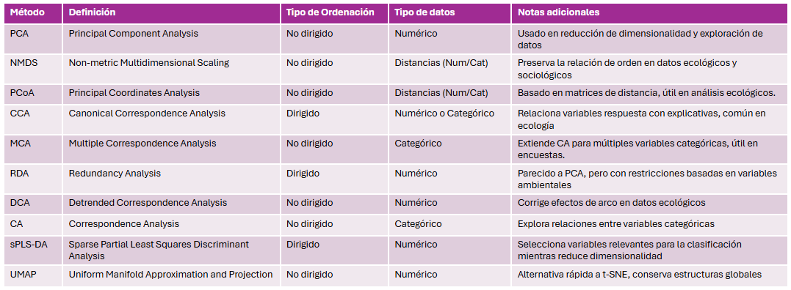

En aquest apartat mostro les diferents ordenacions dimensionals que hem fet. Abans però s'ha d'entendre que és una ordenació dimensional i quins tipus existeixen i per a que serveixen.

De manera simple vol dir que les dades s'ordenen a l'espai depenent de les seves característiques. Els individus que siguin semblants s'ajuntaran i els que siguin diferents es separaran. En la nostra línia de recerca ens interessaria que els del mateix grup s'ajuntin, però els grups diferents se separin.

Existeixen els mètodes dirigits i no dirigits. En el primer cas el mètode sap les característiques per les quals tu vols que es separin, i en el segon cas no. Depenent de l'investigador i l'objectiu es pot utilitzar un o altre.

Existeixen molts mètodes per a l'ordenació, en aquesta taula feta per la Marina i la Karla en podeu veure les característiques bàsiques:

Aquí trobareu els que jo he anat fent.
